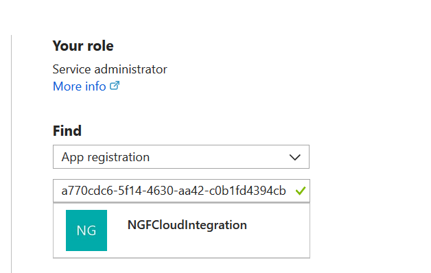
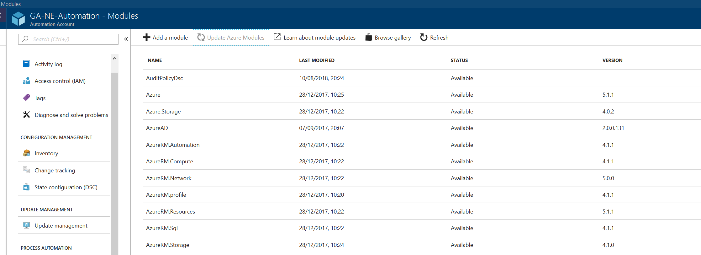
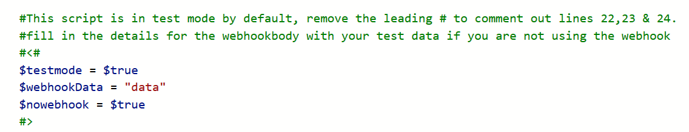
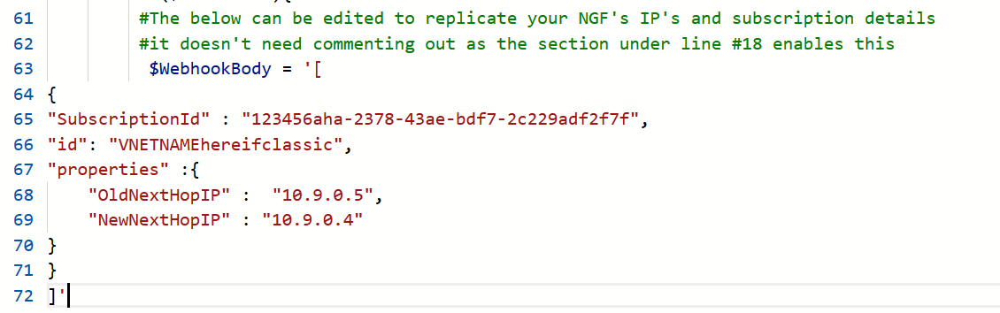

This project is intended to provide an example of how you can utilise scripts on the Barracuda NextGen Firewall F-Series to trigger Azure
Automation actions via Webhooks. 

In this project the CGF triggers a webhook that triggers an Azure automation script to performs updates to user defined routes.  
It can be used to expand the scope within which the CGF can update UDR to multiple subscriptions and multiple VNET's. It can also be used to improve failover times in complex ASM environments or ASM peered VNET's but please review the Classic section for more details

*Please note that the Standard Load Balancer feature in Azure will provide quicker and stateful failover and it the recommended HA solution for peered VNET's*

All Python scripts are intended to be invoked on an CGF firewall via Python2.7. 
The powershell is a Azure Automation workflow which should be triggered within Azure automation.

Within this project you will find included 5 script files. 

1. CGF_call_udr_webhook.py - gathers the local CGF information and submits to Azure Webhook for firewalls on 7.1 or later firmware.
1. CGF_call_udr_webhook_pre71.py - gathers the local CGF information and submits to Azure Webhook for firewalls on 7.0 or earlier firmware.
2. CGF_UDR_Workflow.ps1  - Runs in Azure automation as a workflow to performed the UDR rewrites
3. trigger_udr_webhook.sh - used to trigger the python on the CGF.
4. CGF_ASM_UDR_Powershell.ps1 - Runs in Azure automation as a powershell runbook (*not a workflow*)

# Workflow.

- CGF Failover triggers running of trigger_udr_webhook.sh shell script
- Shell script calls CGF_call_udr_webhook.py 
- CGF_call_udr_webhook.py  gathers information about the cluster IP's and the local subscription and calls the Azure Automation webhook
- CGF_UDR_Workflow.ps1 running in Azure Automation takes the information provided and updates UDR's not in the local subscription.

# Updates
-ASM support added
-Retry mechanism adde so the script will retry if it encounters a failure with the webhook call for up to 10 times with an increasing delay between times

# Installation

1. Temporarily enable SSH onto the box. Either by following the campus steps or very temporarily enabling root login and disabling Force Key Authentication. 
To enable SSH access review the following articles on our campus website [here](https://campus.barracuda.com/product/cloudgenfirewall/doc/73719781/how-to-enable-ssh-root-access-for-public-cloud-firewalls/) and [here](https://campus.barracuda.com/product/cloudgenfirewall/doc/73719739/how-to-configure-ssh). 
Alternatively, if you don't want to create a key then password Authentication can be enabled by selecting Configuration Mode > Switch to Advanced and then opening the Advanced Settings. Make sure to add a BoxACL to limit access to SSH from specific IP's or remove access to SSH access after the changes.

2. On the CGF via SSH run: 
	`
	mkdir /root/azurescript
	`

3. Copy the CGF_call_udr_webhook.py and trigger_udr_webhook.sh onto the CGF firewall into the azurescript folder. *Do this for both CGF's!*

4. Run the following commands to set the permissions
	`
	chmod 777 /root/azurescript/CGF_call_udr_webhook.py
	chmod 777 /root/azurescript/trigger_udr_webhook.sh
	`

*Complete Step 7a and 12 onwards if deploying for ASM only.*	

5. From the CGF download the arm.pfx you created in order to configure Cloud Integration. If you don't have the pfx on the CGF you can use open SSL to convert the PEM to PFX.
	`
	Convert your PEM's to PFX on the CGF via;
		openssl pkcs12 -export -out arm.pfx -inkey arm.pem -in arm.pem 
	`

6. Using the Application ID you configured for Cloud Integration, search in the Azure AD section of the portal for the Application you created. Under that Application create a new Key and make a note of the value provided (as you cannot see this again)

7. In Azure Automation (Create an account if necessary) create a new Powershell Workflow runbook and insert the content of UDR_Workflow.ps1 . Note the Workflow name should be edited to match the name you have given the runbook in the portal.

7a. For ASM in Azure Automation (Create an account if necessary) create a new Powershell Runbook and insert the content of ASM_UDR_Powershell.ps1

8. In Azure Automation go into Modules and Browse the Gallery and make sure you have at least the below 4;
		AzureRM.profile
		AzureRM.resources
		AzureRM.Network
		AzureRM.Automation
		Azure *for ASM*

9. In Azure Automation, Import the arm.pfx (created on the CGF previously) into Certificates
	
Once imported make a note of the certificate thumbprint as you will need it in the next step. 

10. In Azure Automation, Create a new Connection of type Azure ServicePrincipal and populate with the same values as the CGF's Cloud Integration page. Except
for the SubscriptionId which you should leave as *

10a. In Azure Automation create a new variable called "CGFFailoverkey" and set it's encyrpted value to be the key value from Step 4a.

10b. Go back into and edit the runbook, change the $connectionName variable to be the name of the service principal you created.
       ` #Set this to the name of your Azure Automation Connection that works with the NGF service principal
        $connectionName = "yourconnectionName"`

11. Within Azure for every subscription that you want this script to modify routes in assign the CGF Service Principal Read Access to the subscription and
 contributor/owner access to the resource group containing the VNET and routes. Be patient sometimes this get's cached so you may need to wait for this to clear

12. Now go into the Runbook you created and create a Webhook, take a note of the URL now! 

13. On the CGF go into Configuration Tree, Virtual Services, S1, Properties and to the Startup Script add;
	`	/root/azurescript/trigger_udr_webhook.sh -u=<url to webhook> `

13a. If you are running a Control Center managed CGF then also provide the name of the NGFW service by passing the parameter "-s" followed by the service name. e.g 
`	/root/azurescript/trigger_udr_webhook.sh -u=<url to webhook> -s=<SERVICENAME>`

13b. If this is for ASM VNET then pass the VNET name with "-v" followed by the VNET name
`	/root/azurescript/trigger_udr_webhook.sh -u=<url to webhook> -v=<MYVNETNAME>`

 
14. By default the script is in testmode, you can per the screenshot below comment out this section to allow the script to make changes. To run in production with changes being made then comment out these 3 lines.  

To supply test data without invoking the script from the CGF then you can edit the test data to mimic your clusters details. To use these values ensure $nowebhook is set to $true in the section mentioned above.
		

Notes. 

By default this script doesn't try to interact with the subscription that the CGF is located in, to allow it to do this uncomment line 166 & 238 of CGF_UDR_Workflow.ps1

# Multi NIC.

Multi NIC deployments are not recommended for their complexity, however if you insist then per the example in trigger_udr_webhook.sh call the python with an additional -n parameter
`	/root/azurescript/trigger_udr_webhook.sh -u=<url to webhook> -n=<nicname>`
So if you have a multi-NIC device in Control Center then an example command would be;
`	/root/azurescript/trigger_udr_webhook.sh -u=http://url -s=SERVICE1 -n=eth1 `
The value of this parameter should be the name you give to the additional IP on the box (please make sure they are the same name for both Network and HA Network)
The script will look these up and trigger the automation twice, once for each NIC pair. 

# Classic (Azure Service Management)
This script can be used to enhance failover speed for complex ASM environments or perform failover for peered VNET's in Classic subscriptions. The script operates on the pricipal that two route tables have been configured
one with NextHopIP's pointing at the primary FW IP and another set pointing at the secondary FW IP. The second set of routes is expected to share the same name as the first except for a suffix to identify them as belonging to the secondary.
For example;
routetable_1 points to the primary and routetable_1_B would point to the secondary. This script will then operate to detach and attach the appropriate route table depending which unit is active

The powershell has been written to keep the scripts on the CGF transferable between ARM and ASM and also to allow for both to be triggered if needed. 

If you wanted to trigger both a ASM and ARM automation rewrite from the same cluster it is just a case of repeating step 12 so that the Startup Script calls upon the automation twice.

# Troubleshooting.
Issues can occur in a few locations the below guide should help you identify which area is preventing the script from completing succesfully. 

1. Permissions - if the script cannot see any route tables check that the permissions are correctly assigned to the subscription, route tables and the script is using the correct ones in the automation account
2. Test Mode - to prevent inadvertent damage the script defaults to test mode, but make sure you turn this off before you go live.
