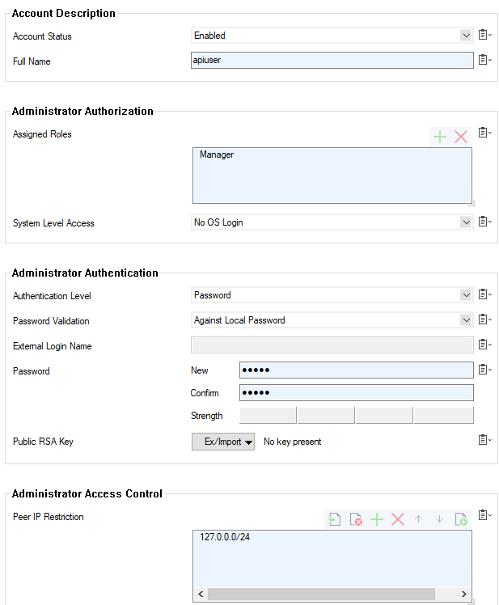
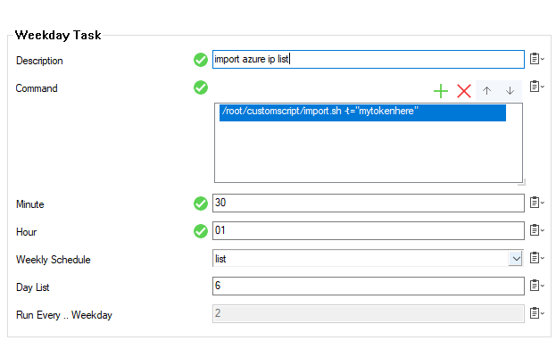

# Barracuda CloudGen Firewall: Creating network objects from a published list

## Introduction
This project is intended to provide an example of how you can utilise scripts on the Barracuda CloudGen Firewall to update the ruleset with network objects. 
The two examples included here allow the firewall to import all of the published Azure ranges and all of the published Office365 ranges. 

## Components
Within this project you will find included 2 script files and a example configuration to import into the Barracuda CloudGen Firewall. 

1. trigger.sh - used to trigger the python on the CGF.
2. import_azure_ips.py - python script that downloads the published Azure IP's and added them as a series of network objects dependent on region and purpose.
3. import_o365_ips.py - python script that downloads the published Office 365 IP's and adds them as a single CustomObject'

## Workflow

- A scheduled task in the Firewall triggers the import.sh script to run.
- The trigger script is used to pass variables into the python script from shell.
- vpncheck.py tests if the "primary" VPN is connected if it isn't it will enable the firewall rule that directs traffic down the secondary VPN. When it detects the Primary VPN is available it will disable the rule sending traffic down the Secondary VPN.

## Installation

1. In Firewall Admin, go to Administrators and create a new user for the API.  Give the user Manager permissions and restrict them to the Peer IP range: 127.0.0.0/24

2. Next still in Firewall Admin, following the steps in the below article create a new auth token for that API user.  The REST API is only availble locally by default which is what this script uses. You do not need to create an access rule unless using it externally.
[RESTAPI](https://campus.barracuda.com/product/cloudgenfirewall/doc/79462646/rest-api/)

Once created make a note of the token as that will be needed next.

3. Temporarily enable SSH login and

4. Run the following command to create the directory we will place the scripts in.
	`
	mkdir /root/customscript
	`

5. Navigate into the directory
	`
	cd /root/customscript
	`

6. Copy into this folder the import.sh and import_azure_ips.py files.
7. Run the following commands to set the permissions on the files.

	`
	chmod 775 import_azure_ips.py
	chmod 775 import.sh
	`

8. Go back to the Config Tree and under Advanced Configuration > System Scheduler > Monthly Schedule create a new Weekday Schedule. 

9. You can check that the script has run by taking a look into the log file: /phion0/logs/box_Azure_azureip_updates.log

# Further Information

Below are some of the optional parameters within the script. 

Firstly import.sh only requires the -t="tokenvalue" parameter.  Any other customisations should be passed on by editing the command within import.sh to pass onto the python. 

`
-t or --token - when the scripts input via API this is the authentication token to supply
`

The above parameter is essential the below parameters are optional unless you are not running defaults, such as S1.

`
-s or --source = the URL to collect the information for. Defaults to the Azure or O365 publishing URL
 -i or --insecure - add this only if you wish to bypass SSL when downloading the source url
-a  or --api - when the scripts update via API they will use the local connection, only change this if essential, provide format IPorFQDN:port
-x or --virtualserver - provide if your firewall has a non standard virtual server. Defaults to S1, for v8 provide this as -x CSC
-f or --firewallname - provide the name of the firewall service if changed from standard NGFW
`

## Troubleshooting
This script will write logs into /phion0/logs/box_Azure_azureip_updates.log
REST API errors are logged in the Logs > REST > restd log. You may need to enable debug level logging in the Config Tree > Infrastructure Services > REST API Service.

##### DISCLAIMER: ALL OF THE SOURCE CODE ON THIS REPOSITORY IS PROVIDED "AS IS", WITHOUT WARRANTY OF ANY KIND, EXPRESS OR IMPLIED, INCLUDING BUT NOT LIMITED TO THE WARRANTIES OF MERCHANTABILITY, FITNESS FOR A PARTICULAR PURPOSE AND NONINFRINGEMENT. IN NO EVENT SHALL BARRACUDA BE LIABLE FOR ANY CLAIM, DAMAGES, OR OTHER LIABILITY, WHETHER IN AN ACTION OF CONTRACT, TORT OR OTHERWISE, ARISING FROM, OUT OF OR IN CONNECTION WITH THE SOURCE CODE. #####

