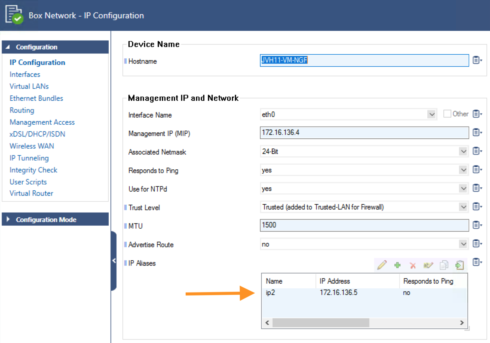
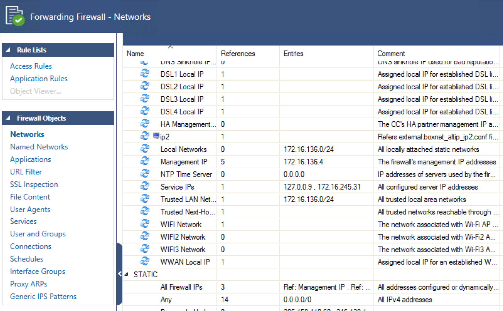
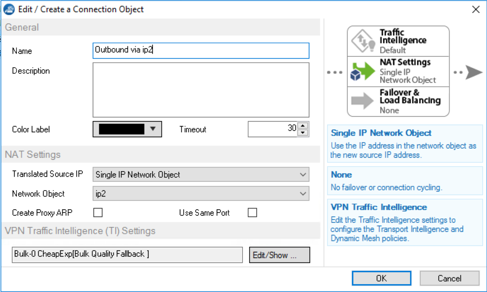
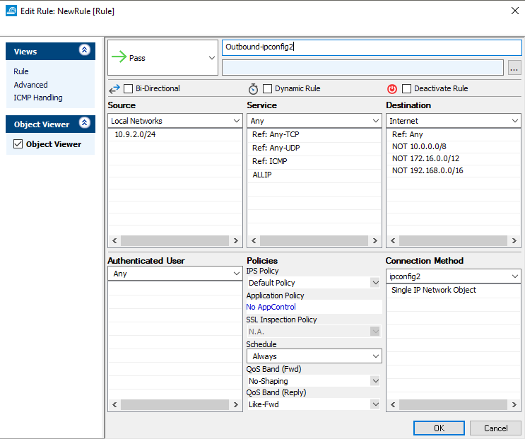

# Barracuda CloudGen Firewall: Updating dynamic objects with the IP aliases of the network interface. 

## Introduction
This project is intended to provide an example of how you can utilise scripts on the Barracuda CloudGen Firewall to update dynamic objects and multiple ipconfigs in Azure. In Azure you can have . 

In this project a python script on the CGF units is triggered upon starting the virtual server (e.g. on failover or boot time) to read the configuration and adapt the dynamic object with the correct ip alias of the active CGF unit. This allows for NAT behind an IP alias for outbound connections. In Azure outbound NAT is only possible to either the load balancer public IP when there are no public IP's on the VM NIC. If there are public IP's on the VM NIC these IP's will be used. To have more public IP's we can NAT behind IP aliases on the VM NIC.

## Components
Within this project you will find included 2 script files and a example configuration to import into the Barracuda CloudGen Firewall. 

1. multiip_object_rewrite.py - gathers the local CGF information and updates the dynamic object files
2. trigger_multiip_rewrite.sh - used to trigger the python on the CGF.
3. network_object_template.conf - sample configuration object for a dynamic IP generated from file. 

## Workflow

- CGF Failover triggers running of trigger_multiip_rewrite.sh shell script
- Shell script calls multiip_object_rewrite.py 
- multiip_object_rewrite.py gathers information about the additional IP's on the box and updates files supporting dynamic objects

## Installation

1. Firstly prepare the CGF cluster with the necessary IP information. In Box > Network and Box HA > Network configure additional IP Aliases under the Management IP. Do this for each additional ipconfig you have in Azure. 
Ensure the names match on each Networks setting page. 

2. Next prepare the FW rules by pre-creating the dynamic objects, to allow you to create the right type take the project file 'network_object_template.conf' and
copy it into a text editor. For each ip Alias you created you will need to import an object per the below steps. 
	a) Search for the string "youripname" in the conf file, replace this text with the name you gave your network objects. (rule 33, 37 and 47)
	b) Once edited Select All into your clipboard
	c) Go to Forwarding Firewall Rules, Network Objects and right click and Paste

You should now have new object entry named after the additional IP's configured in the box network. It is critical all these names match exactly. The entry 'sourceFile={external.boxnet_altip_youripname.conf}' is the filename that the script will create on the filesystem of the CGF.

3. Now we prepare the scripts for failover, temporarily open SSH and on each CGF via SSH run: 
	`
	mkdir /root/azurescript
	`

To enable SSH access verify the following article on our  website. Password Authentication can be enabled by selecting Configuration Mode > Switch to Advanced and then opening the Advanced Settings. Make sure to add a BoxACL to limit access to SSH from specific IP's or remove access to SSH access after the changes.

2. Copy the multiip_object_rewrite.py and trigger_multiip_rewrite.sh onto the CGF firewall into the azurescript folder. Do this for both CGF's!

3. Run the following commands to set the permissions
	`
	chmod 755 /root/azurescript/multiip_object_rewrite.py
	chmod 755 /root/azurescript/trigger_multiip_rewrite.sh
	`
4. If you are running your CGF with custom service and server names you can edit trigger_multiip_rewrite.sh to include their details e.g 
(further input options can be collected by running python2.7 multiip_object_rewrite.py --help)
			`	/root/azurescript/multiip_object_rewrite.py.sh -i yourservername -s youservicename  `
By default the trigger_multiip_rewrite.sh will use the default values servername = S1, servicename = NGFW
			`	/root/azurescript/multiip_object_rewrite.py.sh -i yourservername -s youservicename  `
	
5. On the CGF go into Configuration Tree, Virtual Services, S1, Properties and to the Startup Script add;
	`	/root/azurescript/trigger_multiip_rewrite.sh  `

6. Once complete you can test this by failing over, you can view the dynamic objects and their IP's in Firewall > Forwarding Firewall Rules > Networks > Dynamic 

7. Finally to use these for an outbound NAT, create a Connection Object referencing this new Single IP dynamic object and use that in the ruleset.

## Troubleshooting
This script will write logs into /phion0/logs/multi_ip_replace.log

##### DISCLAIMER: ALL OF THE SOURCE CODE ON THIS REPOSITORY IS PROVIDED "AS IS", WITHOUT WARRANTY OF ANY KIND, EXPRESS OR IMPLIED, INCLUDING BUT NOT LIMITED TO THE WARRANTIES OF MERCHANTABILITY, FITNESS FOR A PARTICULAR PURPOSE AND NONINFRINGEMENT. IN NO EVENT SHALL BARRACUDA BE LIABLE FOR ANY CLAIM, DAMAGES, OR OTHER LIABILITY, WHETHER IN AN ACTION OF CONTRACT, TORT OR OTHERWISE, ARISING FROM, OUT OF OR IN CONNECTION WITH THE SOURCE CODE. #####