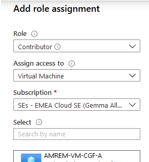
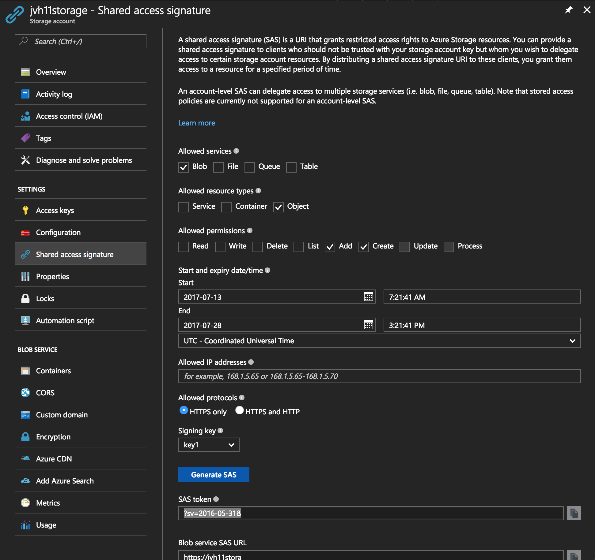

# Backup Scripts for Barracuda CloudGen Firewall F-Series and CloudGen Control Center

## Introduction
The scripts in this project will backup the configuration of the Barracuda CloudGen Firewall F-Series or the Barracuda CloudGen Control Center to either an FTP server or an Azure Blob Storage Container.

There are 3 available scripts. 
<ol>
<li> Those ending in blob - which are for version 8 and above</li>
<li> Those ending in v7blob - which are for version 7 and below </li>
<li> Those with no special ending which upload to FTP</li>
</ol>

## Installation version 8.x
<ol>
    <li>It is presumed your Firewalls were built using managed system identifies or a user assigned identity, if not you can configure these following the instructions [here](https://docs.microsoft.com/en-us/azure/active-directory/managed-identities-azure-resources/qs-configure-portal-windows-vm) </li>
    <li>Copy the script to the firewall into <code>cd /customscript/<filename></code></li>
    <li>Verify and make sure the script is executable: <code># chmod 755 ngfbackup-as.sh</code></li>
    <li>In the Azure portal go to the storage account created to receives these backups, go into IAM and assign the Contributor role to the Virtual Machine roles for the Firewalls </li>
    <li>Trigger the script providing the name of the storageaccount and container for example <code> ./customscript/cgfbackup-blob.sh -s=storageaccountname -c=containername </code></li>
    <li>If need you can configure the script to email out, please edit the SMTP varibles directly in the script to do this.</li>
    <li>Schedule the script to run every day or week using the cronjob functionality in the system. More info can be found <a href="https://campus.barracuda.com/product/CloudGenfirewallf/article/NGF71/ConfigCronjobs/">here</a></li>
</ol>

## Installation version 7.x
<ol>
    <li>Copy the script to the firewall into <code>cd /customscript/<filename></code></li>
    <li>Verify and make sure the script is executable: <code># chmod 755 ngfbackup-as.sh</code></li>
    <li>Setup the Storage Access Signature per "Retrieve the Shared Access Signature"
    <li>Adapt the variables as needed in the script and copy the script on the CGF or CGCC.</li>
    <li>Run the script to verify everything is working fine.</li>
    <li>Schedule the script to run every day or week using the cronjob functionality in the system. More info can be found <a href="https://campus.barracuda.com/product/CloudGenfirewallf/article/NGF71/ConfigCronjobs/">here</a></li>
</ol>

### Retrieve the Shared Access Signature

The Shared Access Signature token is generated based on the access keys in the Azure Storage container. It is valid for a specific timeframe. When the access key is deleted it is also becomes invalid. It is best to configure start date an time of the Shared Access Signature well before you do you tests. (1 day extra for example).

To retrieve Shared Access Signature you need access to the Azure Portal.

<ol>
    <li>Login into the Azure Portal</li>
    <li>Create or access the Azure Storage Account you want to use for your the backup</li>
    <li>Create a new container that will be hold the backup</li>
    <li>Go to the 'Shared Access Signature' option and create the token. The minimal requirements are Access to Blob, Allow Object resource type and the persmission to Add and Create."/></li>
    <li>Copy the SAS token start with '?sv=' in the variable in the backup script.</li>
</ol>

##### DISCLAIMER: ALL OF THE SOURCE CODE ON THIS REPOSITORY IS PROVIDED "AS IS", WITHOUT WARRANTY OF ANY KIND, EXPRESS OR IMPLIED, INCLUDING BUT NOT LIMITED TO THE WARRANTIES OF MERCHANTABILITY, FITNESS FOR A PARTICULAR PURPOSE AND NONINFRINGEMENT. IN NO EVENT SHALL BARRACUDA BE LIABLE FOR ANY CLAIM, DAMAGES, OR OTHER LIABILITY, WHETHER IN AN ACTION OF CONTRACT, TORT OR OTHERWISE, ARISING FROM, OUT OF OR IN CONNECTION WITH THE SOURCE CODE. #####
