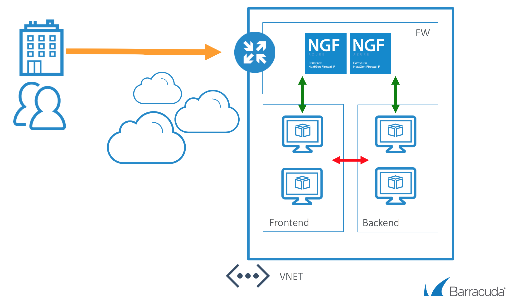

# Barracuda Next Gen Firewall F Series Quick Start High Availability

## Introduction
This HashiCorp Terraform template deploy the Barracuda Next Gen Firewall F Series in a new VNET. Deployment is done with in a one-armed fashion where north-south, east-west and VPN tunnel traffic can be intercepted and inspected based on the User Defined Routing that is attached to the subnets that need this control. Do not apply any UDR to the subnet where the NGF is located that points back to the NGF. This will cause routing loops.

To adapt this deployment to your requirements you can modify the variables.tf file and/or the deployment script.



## Prerequisites
The solution does a check of the template when you use the provide scripts. It does require that [Programmatic Deployment](https://azure.microsoft.com/en-us/blog/working-with-marketplace-images-on-azure-resource-manager/) is enabled for the Barracuda Next Gen Firewall F BYOL or PAYG images. Barracuda recommends use of **D**, **D_v2**, **F** or newer series. 

## Deployed resources
Following resources will be created by the template:
- One Azure VNET with 3 subnets (for the NGF, frontend and backend)
- One route table for each frontend and backend subnets that will route all traffic to the NGF including the traffic to the other internal subnet
- Two Virtual machines with a network interface and public IP
- 1 external load balancer for inbound traffic from internet towards the NGF cluster

**Note** The frontend and backend subnets and resources are created by the template. Any additional subnets and configuration can be added in the template or added manually.

## Template Parameters
| Parameter Name | Description
|---|---
password | Password for the Next Gen Admin tool 
location | The region for the deployment
prefix | identifying prefix for all VM's being build. e.g WeProd would become WeProd-VM-NGF (Max 19 char, no spaces, [A-Za-z0-9]
imageSKU | SKU Hourly (PAYG) or BYOL (Bring your own license)
vmSize | Size of the VMs to be created
vnet | Network range of the VNET (e.g. 172.16.136.0/22)
subnet_ngf | Network range of the Subnet containing the NextGen Firewall (e.g. 172.16.136.0/24)
subnet_frontend | Network range of the frontend subnet (e.g. 172.16.137.0/24)
subnet_backend | Network range of the backend subnet (e.g. 172.16.138.0/24)
ngf_a_ipaddress | Static internal IP address of the first NGF (e.g. 172.16.136.10)
ngf_b_ipaddress | Static internal IP address of the second NGF (e.g. 172.16.136.11)
ngf_subnetmask | Subnetmask of the internal IP address of the NGF (e.g. 24)
ngf_defaultgateway | Default gateway of the NGF network. This is always the first IP in the Azure subnet where the NGF is located. (e.g. 172.16.136.1)

## Launching the Template

Terraform requires Azure Credentials to deploy to the correct subscription. Terraform recommends [using a Service Principal when running in a Shared Environment](https://www.terraform.io/docs/providers/azurerm/authenticating_via_service_principal.html) (such as within a CI server/automation) - and [authenticating via the Azure CLI](https://www.terraform.io/docs/providers/azurerm/authenticating_via_azure_cli.html) when you're running Terraform locally using the Azure Cloud Shell.

Credentials to be installed in the NGF or to access Azure can be stored in a secrets.tfvars file with the following format:

```
password        = ""
subscription_id = ""
client_id       = ""
client_secret   = ""
tenant_id       = ""
```

Alternatively these credentials can be provided using when launching terraform as [an argument](https://www.terraform.io/intro/getting-started/variables.html) or [via environment variables](https://www.terraform.io/intro/getting-started/variables.html). The package provides a deploy.sh and deploy-docker.sh script. The deploy.sh can be used when Terraform is installed localy. The deploy-docker.sh will deploy using Terraform available in a docker image. Terraform is also available in the Azure Cloud Shell. 
To delete the whole deployment you can use the destroy.sh or destroy-docker.sh script.
